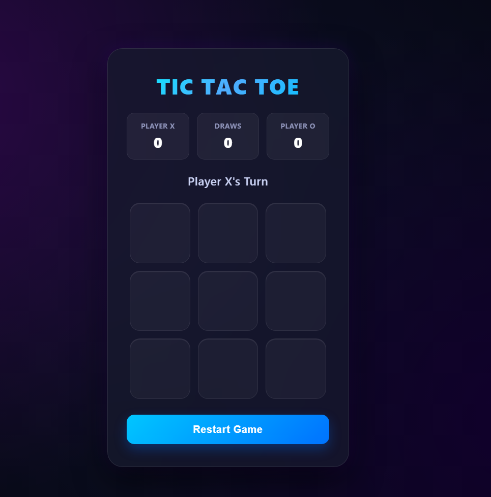

 A simple and responsive Tic Tac Toe game built using HTML, CSS, and JavaScript.
##  Live Demo

[Play Tic Tac Toe]( https://jagadeeshpolamarasetty666-del.github.io/Tic-tac-toe/)
##  Features

- Two-player gameplay
- X and O turns
- Winner detection
- Draw detection
- Restart button
- Responsive interface

##  Technologies Used

- HTML5
- CSS3
- JavaScript

##  Screenshot

##  Future Improvements

- Player vs Computer
- Score tracking
- Difficulty levels
- Winning animation
- Sound effects
- Mobile UI improvements
